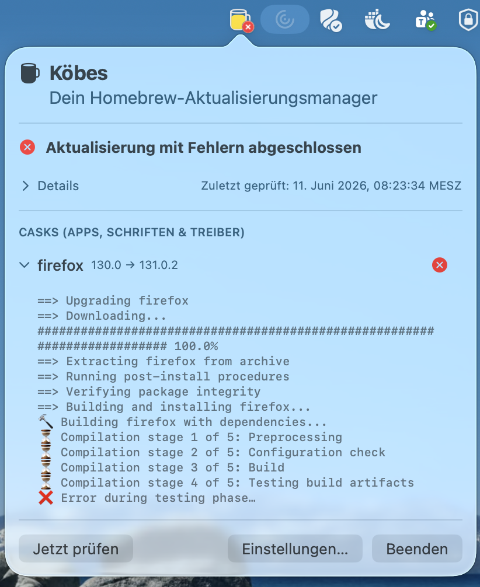

# 🍻 Köbes

**Köbes** is a lightweight macOS background utility that monitors your Homebrew environment and notifies you the moment updates are ready.

**Current app version:** 1.0.0

Just like a traditional Cologne *Köbes* (the legendary local pub waiter) who keeps bringing you fresh glasses of Kölsch without you ever having to ask, this tool works silently in the background to ensure your formulas and casks are always served fresh.

## Features

- **Menu bar status icon** showing the current state:
  - Green checkmark: all packages are up to date
  - Warning triangle: updates are available
  - Spinning arrows: checking for updates
  - Red X: error occurred
- **Package list** with checkboxes to select which packages to update
- **Select/deselect all** toggle
- **Per-install update mode choice**: when starting an update, choose between
  normal installation and a forced reinstall with `brew reinstall --force` for that run
- **Live update log** showing `brew upgrade` output
- **Configurable check interval** (5–1440 minutes)
- **Autostart at login** option with network-aware startup (the first check is
  deferred until a network connection is available, so no spurious errors occur
  when the app is launched automatically at login)

## Screenshots

### Everything Up-To-Date


### Updates Available


### Update Installation (With Simulated Error)


### Update Installation With Expanded Details (Simulated Error)


## Requirements

- macOS 13.0 or later
- [Homebrew](https://brew.sh) installed
- Swift 6 toolchain (included with Xcode 16+)

## Build

```bash
make all
```

The app bundle is created at `.build/Koebes.app`.

## Run

```bash
make run
```

## Test

```bash
make test
```

## Mock Mode

To test the UI without real Homebrew updates, use the mock build. This injects
fake packages (including one simulated failure) so you can exercise the full
update flow:

```bash
make clean && make run-mock
```

Mock mode uses the `DEBUG_MOCK` compile flag. The mock data is defined in
`Constants.MockData`.

**Behavior:** Mock mode toggles between "no updates available" and "updates
available" on each check. The app starts showing no updates; the first manual
check or scheduled check will show updates available, the next check will show
no updates again, and so forth. This allows you to test both states without
restarting the app.

> **Note:** When switching between mock mode and normal mode, always run
> `make clean` first. The compile flag changes are not detected by the
> incremental build.

## Install

Copies the app to `/Applications` :

```bash
make install
```

## Uninstall

```bash
make uninstall
```

## Clean

```bash
make clean
```

## Project Structure

```
Sources/
  main.swift           - Application entry point
  AppDelegate.swift    - Menu bar status item and popover management
  BrewManager.swift    - Homebrew interaction (check/update packages)
  Constants.swift      - Centralized constants
  KeychainHelper.swift - Securely store sudo password in macOS Keychain
  Localization.swift   - EN/DE translations
  MenuBarView.swift    - Main popover UI (package list, controls)
  Settings.swift       - Persistent settings (interval, autostart)
  SettingsView.swift   - Settings dialog UI
  UpdateState.swift    - State enum and BrewPackage model
Tests/
  Tests.swift          - Unit tests
```

## Configuration

Open Settings from the menu bar popover to configure:

- **Check interval**: How often (in minutes) the app checks for updates. Range: 5–1440.
- **Start at login**: Whether the app launches automatically when you log in.
- **Include auto-updating casks (greedy)**: Also check casks that update themselves.
- **Use saved sudo password from Keychain**: When enabled, casks that need
  `sudo` (e.g. `docker-desktop`) authenticate using a password stored in the
  macOS Keychain instead of prompting you each time. Use **Save Password…** to
  store your macOS account password and **Forget Password** to remove it.
- **App Management permission**: macOS requires the *App Management* permission
  to update app bundles (casks such as Firefox, Docker, etc.). Click **Open App
  Management Settings…** to open *System Settings → Privacy & Security → App
  Management*, find Koebes in the list, and enable the toggle. This is a
  one-time step; without it, cask upgrades that replace `.app` bundles will
  fail.

### About the App Management permission

When Homebrew upgrades a cask (a `.app` bundle like Firefox or Docker Desktop),
macOS will block the operation unless the upgrading process has *App Management*
permission. Grant it once via **Settings → Permissions → Open App Management
Settings…**, then enable the toggle next to Koebes in the list that opens.

Without this permission, cask upgrades may fail silently or produce a
`Permission denied` error in the update log.

### About the saved sudo password

The password is stored as a generic password item in your **Login Keychain**
(service `de.devk.koebes.sudo`, account = your macOS user
name). macOS encrypts the value and protects it via the keychain ACL. When you
save the password for the first time, the app immediately performs a test read
using the same `security` CLI tool that is used during upgrades. This triggers
the macOS "Allow access?" dialog right then — while you are still in Settings —
so you can choose **Always Allow** and avoid being prompted again during an
actual upgrade. You can inspect or remove the entry at any time in
**Keychain Access**.

If the toggle is off, the app falls back to the default behavior of showing a
native macOS password dialog whenever `sudo` is required during an upgrade.

## Force Update Mode

When you click **Update Selected**, Koebes asks which update mode to use:

- **Update Selected**: normal Homebrew upgrade
- **Update Selected with --force**: force-reinstalls the selected package(s) with `brew reinstall --force` for this update run only

This choice is intentionally temporary and is not saved as a permanent setting.

Why force mode might be necessary:

- Some packages can fail to upgrade cleanly because of stale links, replaced files, or partially installed artifacts from earlier installs.
- In those cases, `brew reinstall --force` tells Homebrew to reinstall/overwrite where needed so the package can be brought back to the expected version.
- Because this is a stronger action, it should be used only when a normal upgrade fails or when troubleshooting a broken package state.
