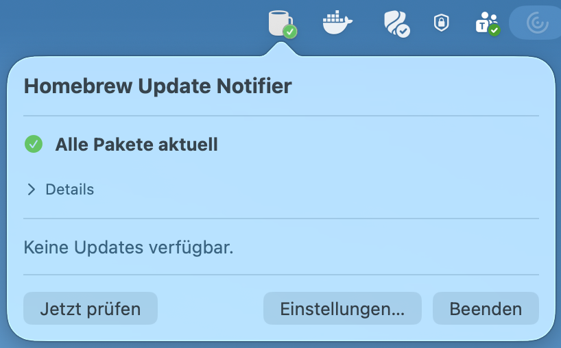
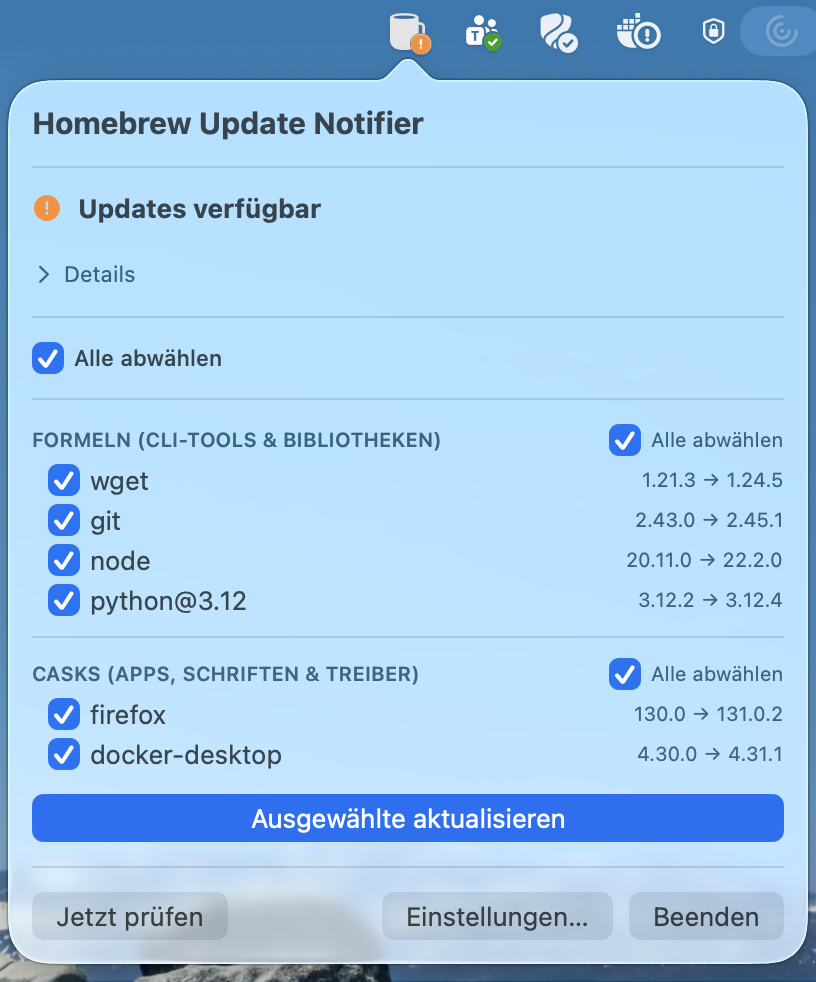
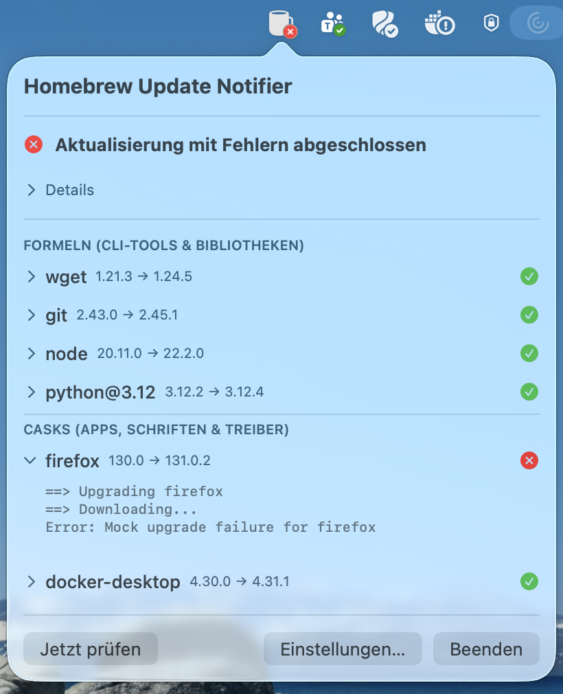

# Homebrew Update Notifier

A macOS menu bar application that monitors installed Homebrew packages for available updates.

## Features

- **Menu bar status icon** showing the current state:
  - Green checkmark: all packages are up to date
  - Warning triangle: updates are available
  - Spinning arrows: checking for updates
  - Red X: error occurred
- **Package list** with checkboxes to select which packages to update
- **Select/deselect all** toggle
- **Live update log** showing `brew upgrade` output
- **Configurable check interval** (5–1440 minutes)
- **Autostart at login** option

## Screenshots

### Everything Up-To-Date


### Updates Available


### Update installation (With Simulated Error)


## Requirements

- macOS 13.0 or later
- [Homebrew](https://brew.sh) installed
- Swift 6 toolchain (included with Xcode 16+)

## Build

```bash
make all
```

The app bundle is created at `.build/Homebrew Update Notifier.app`.

## Run

```bash
make run
```

## Test

```bash
make test
```

## Mock Mode

To test the UI without real Homebrew updates, use the mock build. This injects
fake packages (including one simulated failure) so you can exercise the full
update flow:

```bash
make clean && make run-mock
```

Mock mode uses the `DEBUG_MOCK` compile flag. The mock data is defined in
`Constants.MockData`.

> **Note:** When switching between mock mode and normal mode, always run
> `make clean` first. The compile flag changes are not detected by the
> incremental build.

## Install

Copies the app to `/Applications` :

```bash
make install
```

## Uninstall

```bash
make uninstall
```

## Clean

```bash
make clean
```

## Project Structure

```
Sources/
  main.swift           - Application entry point
  AppDelegate.swift    - Menu bar status item and popover management
  BrewManager.swift    - Homebrew interaction (check/update packages)
  Constants.swift      - Centralized constants
  KeychainHelper.swift - Securely store sudo password in macOS Keychain
  Localization.swift   - EN/DE translations
  MenuBarView.swift    - Main popover UI (package list, controls)
  Settings.swift       - Persistent settings (interval, autostart)
  SettingsView.swift   - Settings dialog UI
  UpdateState.swift    - State enum and BrewPackage model
Tests/
  Tests.swift          - Unit tests
```

## Configuration

Open Settings from the menu bar popover to configure:

- **Check interval**: How often (in minutes) the app checks for updates. Range: 5–1440.
- **Start at login**: Whether the app launches automatically when you log in.
- **Include auto-updating casks (greedy)**: Also check casks that update themselves.
- **Use saved sudo password from Keychain**: When enabled, casks that need
  `sudo` (e.g. `docker-desktop`) authenticate using a password stored in the
  macOS Keychain instead of prompting you each time. Use **Save Password…** to
  store your macOS account password and **Forget Password** to remove it.

### About the saved sudo password

The password is stored as a generic password item in your **Login Keychain**
(service `de.devk.homebrew-update-notifier.sudo`, account = your macOS user
name). macOS encrypts the value and protects it via the keychain ACL: the
first time the app reads it after a code change you may see a one-time
"allow access?" prompt. You can inspect or remove the entry at any time in
**Keychain Access**.

If the toggle is off, the app falls back to the default behavior of showing a
native macOS password dialog whenever `sudo` is required during an upgrade.
